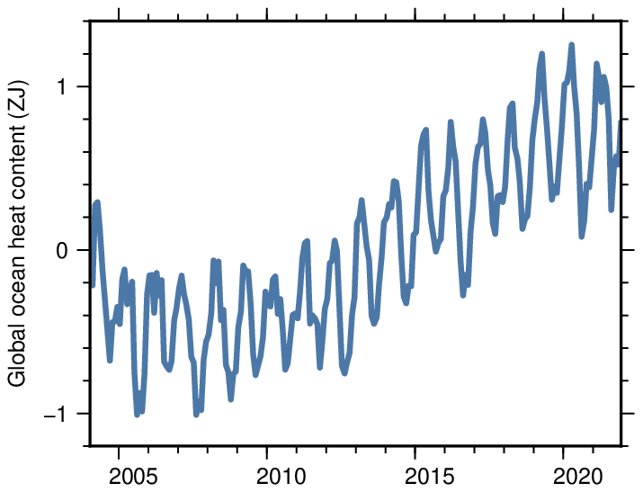
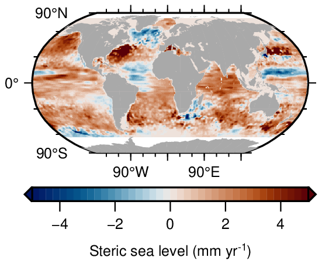

# Manual on HOMAGE steric sea level and OHC scripts 
This document describes the scripts used to compute the steric and ocean heat content anomaly estimates from the HOMAGE project. The HOMAGE project provides gridded estimates of steric sea-level anomalies and Ocean Heat Content (OHC) anomalies. The HOMAGE dataset can be found on [PO.DAAC drive](https://podaac-tools.jpl.nasa.gov/drive/files/allData/homage/L4/sio_ohc/v01).

This repository provides the codes and the underlying theory on how to compute steric sea level and ocean heat content anomalies from ocean subsurface temperature and salinity anomalies, as well as a tutorial on how to execute these scripts, and an example how to plot the output data. 

If you notice bugs or want to add features, please don't hesitate to fill in a bug report or file a pull request. 

Authors: Thomas Frederikse, Felix Landerer, Emmy Killett ([NASA Jet Propulsion Laboratory](https://jpl.nasa.gov))
# Introduction
Changes in the temperature and salinity of sea water affect the water density, which causes sea-level changes. Furthermore, a change in ocean temperatures also means a change in the amount of heat stored in the oceans: the ocean heat content (OHC). Steric sea-level and OHC changes play an important role in many fundamental and applied problems in climate science, including sea-level and coastal hazards studies, physical oceanography, and in determining the Earth Energy Imbalance and the Equilibrium Climate Sensitivity. 

With this software package, we provide fast and easy-to-use Julia scripts to compute steric sea level and OHC from global gridded estimates of temperature and salinity. These estimates can for example come from observations from the Argo network, but the scripts can in principle also process fields from ocean and Earth system models. The scripts compute the following quantities:

- Thermosteric sea level (Sea-level changes due to water temperature changes)
- Halosteric sea level (Sea-level changes due to salinity changes)
- Steric sea level (Sea-level changes due to both water temperature and salinity changes)
- Ocean heat content

All these quantities are computed on a grid for analyzing local changes and are averaged to provide the global mean values. 

# Background
## Computing steric sea level and ocean heat content from temperature and salinity anomalies
Steric sea-level changes can be caused by both changes in temperature and salinity. In a column of water with a constant mass, a change in the temperature $\Delta T$ or salinity $\Delta S$ causes a change in the water density $\Delta \rho$. When the horizontal area of the coluimn does not change, the density change must cause a change in the column height $\Delta \eta$. This column height change is the steric change for which we are looking. Therefore, to compute steric height changes, we need to compute the density changes due to $\Delta T$ 

$$\Delta\rho_T = \frac{\delta \rho}{\delta T}\Delta T $$
and $\Delta S$
$$\Delta\rho_S = \frac{\delta \rho}{\delta S}\Delta S. $$
Then we can compute the height changes from the density as

$$ \Delta \eta = H \left(\frac{\rho_0}{\rho_0 + \Delta \rho} -1 \right) $$

where $H$ is the local ocean depth, and \$rho_0$ is the unperturbed density, or the climatology. Fore more details, see for example [Gregory et al. (2019)](https://doi.org/10.1007/s10712-019-09525-z). To close these equations, we need an estimate of the density changes as a function of temperature and salinity. We discuss this closure in the next section.

Ocean heat content (OHC) anomalies $\Delta \zeta$ can be estimated from temperature anomalies by multiplying the temperature anomalies by the total water volume $V$, the water density $\rho$ and the specific heat capacity of sea water $c_T$:

$$ \Delta \zeta = \rho  c_p V\Delta T.$$

## The discretization and the TEOS-10 Gibbs Sea Water Equations
The data that comes from measurements and models is not continuous and is discretized in space and time. We assume that all input $T$ and $S$ datasets are on a regular longitude $(\phi)$ - latitude $(\theta)$ grid and are sampled at specific height $(z)$ or pressure levels. We then compute all the quantities at each grid cell, which gives a 3-dimensional estimate $(\phi, \ \theta, \ z)$ of each quantity at each time step. We can sum this three-dimensional over a specific depth range to obtain the steric expansion and heat content anomaly over the full water depth, or for example only over the top 700 meters. 

Steric sea levels and ocean heat content are quantities that are relative to a specific baseline. As a baseline, we use a climatology of $T$ and $S$. We use the mean climatology averaged over all months defined by `settings["years_clim"]`. Hence, there is no seasonal cycle in the climatology, and seasonal anomalies are retained in the end result. 

We use the Thermodynamic Equations of Seawater 2010 [TEOS-10](https://www.teos-10.org/) Gibbs Sea Water (GSW) equations to compute the density as a function of $T$ and $S$, as well as the heat content. The key quantities used in GSW are Absolute Salinity $S_A$ and Conservative Temeprature $\Theta$. Most products do not deliver $\Theta$ and $S_A$, which means that we need to convert the source data into these quantities. The TEOS-10 GSW equations provide us with routines to convert temperature or potential temperature and practical salinity into $\Theta$ and $S_A$.
## Overview of the procedure
To obtain the estimates of steric sea-level and ocean heat content anomalies from gridded sub-surface $T$ and $S$ estimate, we have to apply these six steps:

1. Download a set of gridded estimates of temperature and salinity. We refer to this data as the 'source data`. The repository contains a few routines to download these estimates from some often-used sources, such as [IAP](http://www.ocean.iap.ac.cn/), [EN4](https://www.metoffice.gov.uk/hadobs/en4/), [Ishii et al. (2017)](https://climate.mri-jma.go.jp/pub/ocean/ts/v7.3.1/) and [Scripps](https://sio-argo.ucsd.edu/RG_Climatology.html). 

2. Read the grid properties, such as the volume of each grid cell and a sea-land mask. 

3. Read the source data and convert them to $\Theta$ and $S_A$ using TEOS-10 GSW, and write them to a standard format field.

4. Compute the climatology of $\Theta$ and $S_A$ by averaging all fields over the years specified by `settings["years_clim"]`. From this climatology, compute the climatology of the density $\rho$. Save this climatology.

5. For each time step, compute the steric and OHC anomalies relative to the pre-computed climatology.

6. Write the results into a final file.

# Using the scripts
The scripts are all written in the [Julia](https://www.julialang.org) language. Thanks to Julia, the computations are quite fast: it will typically take only a few minutes to convert the source files, compute the climatology, and the steric and OHC changes on a normal desktop or laptop. 

## Prerequisites
To run the scripts, a working Julia installation is needed. Julia can be run from the command line, but to make life much easier, just use [VSCode](https://code.visualstudio.com/) and install the [Julia language plug-in](https://www.julia-vscode.org/). This will allow you to run code snippets from the source files directly at the Julia REPL. 

The software has been written for Julia 1.7 and requires a few dependencies, which can all be installed from Julia's internal package manager. To do so, press `]` at the REPL and type
```Julia
add GMT NCDatasets GibbsSeaWater ZipFile FTPClient 
```
This will install and pre-compile all necessary prerequisites.

Then, download all the scripts from this repository, or directly clone the repository to your local machine. 

## Running the scripts
The main loop is located in `compute_steric_main.jl`. To run the program, type at the command line:
```SH
julia compute_steric_main.jl
```
Some parts of the calculations can be sped up by parallelization. We use both threaded and distributed loops. To parallelize the code, add the `-p` (for multiple processes) and `-t` (for multiple threads), together with the number of processor cores available to the command line. So, if for example you want to use 4 cores, use:
```SH
julia -p4 -t4 compute_steric_main.jl
```
Now the code will apply steps 1-6 from the above procedure. However, the program will likely crash this time, because we need to set it up properly before it runs. To do so, we have to update the settings, which are stored in `compute_steric_main.jl`. 

The first step, is that we have to tell Julia where to find the scripts that need to be imported. One line 13 in `compute_steric_main.jl` there is a line:
```Julia
dir_code = homedir()*"/Projects/HOMAGE/"
```
Modify this line, such that `dir_code` point to the directory where this source code is located. 

Then, we go to the function `def_settings`. This function needs to be set up correctly in order to run. As you can see, the settings are stored in a Dictionary `settings`. We have the following settings that we need to define:

| Settings command | Description |  
| --- | --- | 
| **Model and years** |   |  
| `settings["model_name"]` | This setting describes which product to analyse. Currently accepts the following products: `"BOA"` (BOA-Argo, [Li et al. 2017](http://doi.wiley.com/10.1002/2016JC012285)), `"EN4_l09"` (EN4 with [Levitus et al. 2009](http://doi.wiley.com/10.1029/2008GL037155) XBT/MBT corrections), `"EN4_g10"` (EN4 with [Gouretski et al. 2010](http://linkinghub.elsevier.com/retrieve/pii/S0967063710000671) XBT/MBT corrections) , `"EN4_c13"` (EN4 with [Cowley et al. 2013](http://journals.ametsoc.org/doi/10.1175/JTECH-D-12-00127.1) XBT/MBT corrections), `"EN4_c14"` (EN4 with [Cheng et al. 2014](http://journals.ametsoc.org/doi/10.1175/JTECH-D-13-00197.1) XBT/MBT corrections), `"IAP"` (IAP, [Cheng et al., 2016](http://journals.ametsoc.org/doi/10.1175/JCLI-D-15-0730.1), [2020](https://journals.ametsoc.org/doi/10.1175/JCLI-D-20-0366.1)), `"I17"` ([Ishii et al. 2017](https://www.jstage.jst.go.jp/article/sola/13/0/13_2017-030/_article)), and `"SIO"`(Scripps, [Roemmich and Gilson, 2009](http://linkinghub.elsevier.com/retrieve/pii/S0079661109000160)).  |
| `settings["years"]` |  Sets the years that must be downloaded and processed. Uses the `[2018:2021...]` notation, which runs everything from 2018 until and including 2021. | 
| `settings["years_clim"]` |  Sets the years used for computing the climatology. Uses the `[2018:2021...]` notation, which computes the climatology using all monthly data files from 2018 until and including 2021. | 
| `settings["tvec"]` | An array with the years and months of each time step. Will be set automagically after `settings["years"]` | 
| `settings["tvec_clim"]` | An array with the years and months of each time step for which the climatology is computed. Will be set automagically after `settings["years"]` | 
| **Source and destination directories** |   |  
| `settings["dir_analysis"]` | Sets the directory to which the source files must be downloaded. This directory must be created before running the script. | 
|`settings["dir_analysis_fmt"]` | Sets the directory where the converted monthly $T$ and $S$ files and the climatology must be saved. This directory must be created before running the script. |
| `settings["fn_savefile"]` | Sets the location and file name of the file with the final resulting steric and OHC will be stored. The directory where the file will be stored msut be created before running the script. |
| **Tasks to perform** |   |  
| `settings["download_files"] = true` | Set to `true` to download the raw source data or `false` to skip this step |
| `settings["convert_files"] = true`  | Set to `true` to convert the raw source data to monthly NetCDF files or `false` to skip this step |
| `settings["compute_climatology"] = true` | Set to `true` to compute the climatology or `false` to skip this step |
| `settings["compute_steric_ohc"] = true` | Set to `true` to compute steric and OHC from T and S or `false` to skip this step|

> Be mindful to follow the Julia syntax, which can differ from Python and matlab: 
> - Strings use double `"` and not single `'` quotation marks
> - Strings are concatenated with a `*` and not a `+`.
> - The `homedir()` command is used to obtain the location of the home directory. 
> - The booleans `true` and `false` must not be capitalized. 

An example of the settings could read:

```Julia
    settings = Dict()
    settings["model_name"] = "SIO"
    settings["years"] = [2004:2021...]
    settings["years_clim"] = [2018:2020...]
    settings["tvec"]  = zeros(Int32,12*length(settings["years"]),2)
    settings["tvec"]  = years2tvec(settings["years"])
    settings["tvec_clim"]  = years2tvec(settings["years_clim"])
    settings["dir_analysis"] = homedir() * "/Data/Steric/" * settings["model_name"] * "/analysis/" 
    settings["dir_analysis_fmt"] = homedir() * "/Data/Steric/" * settings["model_name"] * "/analysis_fmt/"
    settings["fn_savefile"] = homedir() * "/Data/Steric/" * settings["model_name"] * "/postprocessed/"*settings["model_name"] * "_steric_ohc_" * string(settings["years"][1]) * "_"*string(settings["years"][end]) * ".nc" 
    settings["download_files"] = false 
    settings["convert_files"] = true  
    settings["compute_climatology"] = true 
    settings["compute_steric_ohc"] = true 
```

In this case, we will run the code for `SIO`, which refers to the Scripps product. We will compute everything for 2004-2021. The baseline will be the climatology over 2018 to 2020. We will not download the source data, but we will convert the source data to the standard format and convert everything to $S_A$ and $\Theta$. We then compute the climatology, and finally do the computation of steric and OHC.

When this is all set correctly, it's time to run the code:

```bash
julia compute_steric_main.jl
```
## Output format
When everything runs well, an output NetCDF file should appear with the name of `settings["fn_savefile"]`. There are many software packages that can read and visualise NetCDF files. An easy-to use and fast viewer is [ncview](http://meteora.ucsd.edu/~pierce/ncview_home_page.html), which can be easily installed from Homebrew or the Debian/Ubuntu repository. For most programming and scripting languages, packages to read NetCDF files are available. 

The output file contains the following variables

| Variable | Description |  Unit |
| ---| --- | --- | 
| `time` | Analysis time steps | Days since 1900-01-01 |
| `lon` | Longitude | Degrees |
| `lat` | Latitude | Degrees |
| `slm` | Sea-land mask | 1 = ocean, 0 = land |
| `ohc_2d` | Gridded ocean heat content anomalies | Joules per grid cell |
| `thermosteric_2d` | Gridded thermosteric sea-level anomalies | m |
| `halosteric_2d` | Gridded halosteric sea-level anomalies | m |
| `totalsteric_2d` | Gridded steric sea-level anomalies | m |
| `ohc_ts` | Global ocean heat content anomalies | Joules |
| `thermosteric_ts` | Global-mean thermosteric sea-level anomalies | m |
| `halosteric_ts` | Global-mean halosteric sea-level anomalies | m |
| `totalsteric_ts` | Global-mean steric sea-level anomalies | m |

To correct for the salinity bias in some Argo profiles ([Hakuba et al. 2021](https://onlinelibrary.wiley.com/doi/10.1029/2021GL093624)), global-mean halosteric sea level has been removed from gridded steric sea level (`totalsteric_2d`). Therefore, the bias is still in all other variables that include salinity (`halosteric_2d`, `halosteric_ts`, `totalsteric_ts`). The thermosteric and OHC estimates are not affected by the salinity bias. 

## Analysing the results

We can read and visualize the output data in Julia. As an example, let's plot the time series of global ocean heat content and a map of the trend in steric expansion from the Scripps dataset. We will be using the [GMT.jl](https://github.com/GenericMappingTools/GMT.jl) package to make the plots. 

The below commands can be combined into a script that can be run by Julia, or can be directly typed in Julia's [REPL](https://docs.julialang.org/en/v1/stdlib/REPL/). The repository contains the script `example_analysis.jl` with all the below commands. 

### Import the dependencies
First, import some dependencies:
```Julia
using GMT
using NCDatasets
using LinearAlgebra
using Statistics
using Dates
```

### Read the data
The next step is reading the output file. We first open a file handle `fh`, and then we read the entries in the file and store them as variables. 
```Julia
fh = Dataset("SIO_steric_ohc_2004_2021.nc","r")
t = nomissing(fh["time"][:]) # Time 
ζ = nomissing(fh["ohc_ts"][:]) # Global-mean ocean heat content anomalies
ϕ = nomissing(fh["lon"][:]) # Longitude
θ = nomissing(fh["lat"][:]) # Latitude
η = nomissing(fh["totalsteric_2d"][:]) # Gridded steric anomalies
close(fh)
```
Here, we assume that the output file `SIO_steric_ohc_2004_2021.nc` is located in the active directory of Julia. 

### Plot global-mean ocean heat content
After reading the data, we plot global ocean heat content $(\zeta)$ versus time $t$:
```Julia
plot(t, ζ/1e23, lw=1.5, lc="#4c78a8", ylabel="Global ocean heat content (ZJ)", show=true, limits=(t[1],t[end],-1.2,1.4),figname="ohc_timeseries.png",figsize=(5,4),conf=(FONT_ANNOT=6,FONT_LABEL=6,PS_LINE_JOIN=round))
```


### Plot a map of the trend in steric sea level
To plot a map with the trends in steric sea level, we first have to compute the linear trend from the time series at each grid cell. We will use ordinary least squares for that. Remember that the mean seasonal cycle is retained in our solution, and thus we should co-estimate the seasonal cycle to avoid that we bias our trend. We approximate the seasonal cycle here by an annual and semi-annual cycle. 


First, we need a numeric time vector:
```Julia
tval = @. year(t) + month(t)/12 - 1/24
```

Then create the design matrix:
```Julia
design_matrix = ones(length(tval),6)
@. design_matrix[:,2] = tval - $mean(tval)
@. design_matrix[:,3] = sin(2π*tval)
@. design_matrix[:,4] = cos(2π*tval)
@. design_matrix[:,5] = sin(4π*tval)
@. design_matrix[:,6] = cos(4π*tval)
```

To speed up the trend calculation, we use a QR decomposition:
```Julia
qrd = qr(design_matrix)
rinv = inv(qrd.R) * qrd.Q'
```

Now create an empty array to store the trends:
```Julia
steric_trend = zeros(length(ϕ),length(θ))
```
And loop over all grid cells to compute the actual trend:
```Julia
for i in CartesianIndices(steric_trend)
    steric_trend[i] = (rinv * η[i,:])[2]
end
```
Then, plot the actual trend (multiplied by 1000, so we have the trend in units $mm \ yr^{-1}$):
```Julia
cpt = makecpt(color=:vik, range=(-5,5,0.25))
grid = mat2grid(steric_trend'.*1000,x=convert.(Float64,ϕ),y=convert.(Float64,θ))
grdimage(grid,projection=:robinson,color=cpt,region=(-180, 180, -90, 90),figsize=(6.5,4),conf=(FONT_ANNOT_PRIMARY=6,FONT_LABEL=6))
coast!(land=:darkgrey)
colorbar!(pos=(anchor=:BC,length=(4,0.2), horizontal=true, offset=(0,0.5),triangles=true), color=cpt, frame=(annot=2, xlabel="Steric sea level (mm yr@+-1@+)"),  show=true, nolines=true,figname="trend_map.png",conf=(FONT_ANNOT_PRIMARY=6,FONT_LABEL=6))
```


## Downloading the Ishii et al. (2017) data
The data from Ishii et al. (2017) is provided in the GRIB2 format, and we were not yet able to get the Julia GRIB package to correctly read the data. Therefore, the Ishii et al. (2017) data can be downloaded and converted using the Python script `dl_cv_I17.py`. This script downloads and converts the source data into monthly NetCDF files that can be analysed with the Julia scripts. Therefore, to process this data, we need Python (tested with version 3.10) and the packages `netcdf4`, `numpy`, `gsw`, and `pygrib`. These packages can be installed with for example `pip` or `conda`. After installing, check the settings in the `def_settings` function in `dl_cv_I17.py`. Like the Julia scripts, set `settings['dir_analysis']` and `settings['dir_analysis_fmt']` to the directories where you want the data to be stored. `settings['years']` controls the years that will be processed, and `settings['nprocs']` the number of parallel processes.

When this is all set, just run from the terminal:
```Bash
python dl_cv_I17.py
```

And everything should work. Then, we can finish the analysis in Julia, by setting `settings["dir_analysis_fmt"]` to the same directory as in the Python script, setting `settings["model_name"]` to `I17`, and setting `settings["download_files"]` and `settings["convert_files"]` to `false`. Then we can run the script and produce the results for Ishii et al. (2017). 

# Steps needed to run this script for other data sources
The scripts can be expanded to apply them to other datasets, such as other observational products or output from for example CMIP6 models. This does require some Julia coding. A great introduction to Julia is this [lecture series](https://book.sciml.ai/) from Chris Rackauckas (MIT). 

First, we need to download the source data. You can either write a download script to do so, or manually download the data and disable the `download_files` flag in the settings. 

Next, we have to manually set up the conversion from the source data into the standard format based on $\Theta$ and $S_A$. First, we need to provide the grid properties. These are stored in a `struct` of the type `grid_struct`, defined in `mod_steric_generic.jl`:
```Julia
struct grid_struct
    # Structure to hold all grid variables
    ϕ :: Array{Float32,1} # Longitude (°)
    θ :: Array{Float32,1} # Latitude (°)
    z :: Array{Float32,3} # Depth (m)
    p :: Array{Float32,3} # Pressure (Pa)
    Δz :: Array{Float32,3} # Height of each grid cell (m)
    Δp :: Array{Float32,3} # Pressure difference over each grid cell (Pa)
    A :: Array{Float32,2} # Area of each grid cell (m²)
    V :: Array{Float32,3} # Volume of each grid cell (m³)
    slm :: Array{Bool,3} # Sea-land mask
end
```
Write a function that reads or computes all these quantities (*check the dimensions of eacht variable and convert to the right data type!*) and store them in a structure using:
```Julia
grid=grid_struct(ϕ,θ,z,p,Δz,Δp,A,V,slm);
save_grid_info(grid,settings)
```
Then we need to write a function that reads the source data and converts it to the standard format. It strongly depends on the source data how this functions should look like, but what we need is for each time step, have a three-dimensional field of $S_A$(`SA`) and $\Theta$(`CT`), compute the density $\rho$ from this data, and save the data. 

The source data is often expressed in potential temperature (`pt`) and practical salinity (`ps`). To convert these fields into $S_A$ and $\Theta$, the GSW toolbox can be used:
```Julia
@. SA = grid.slm * gsw_sa_from_sp(ps,grid.p,$reshape(grid.ϕ,(:,1,1)),$reshape(grid.θ,(1,:,1)));
@. CT = grid.slm * gsw_ct_from_pt(SA,pt);  
```
Note that we use Julia's [dot notation](https://docs.julialang.org/en/v1/manual/functions/#man-vectorized) and add singleton dimensions to the latitude and longitude vectors. With this notation, we apply the conversion to each grid cell.

Then the density $\rho$ can be computed from $S_A$ and $\Theta$:
```Julia
ρ = @. grid.slm * convert(Float32,gsw_rho(SA,CT,grid.p));
```
Here, we multiply all fields with `grid.slm`, our sea-land mask. That ensures all fields that are not in the oceans are set to zero. This avoids the propagation of `NaN` values. 

The converted fields can be saved in the right format by calling:
```Julia
data_monthly = data_struct(SA,CT,ρ)
save_analysis_fmt(settings["dir_analysis_fmt"],settings["model_name"],yr,mnth,grid,data_monthly)
```
Here, `mnth` and `year` must be integers that specify the specific month and year. The codes are written to produce monthly-mean estimates, hence this format. When the grid and the converted grids have been processed, the calculation of the climatology and the steric and OHC anomalies is straightforward. The scripts can read the standard files and will do all the calculations. 

# Known issues

## Mac M1 and GibbsSeaWater
The code does not work as of now when running the native Mac M1 version of Julia. This is caused by GibbsSeaWater, whose backend library has not yet been compiled for the new processor architecture. 

## Python multiprocessing and MacOSX Big Sur
To use the multi-processing routines from the `dl_cv_I17.py` package on MacOSX Big Sur and newer, we need to add the following line to `.bash_profile`:

```Bash
export OBJC_DISABLE_INITIALIZE_FORK_SAFETY=YES
```

## Incomplete years
The code currently does not support computing steric anomalies for years for which the data is not complete, for example if the last few months in the current year are not yet available. However, computing results in such situations can be done by manually removing the non-existent months from `settings["tvec"]` and `settings["tvec_clim]`.

